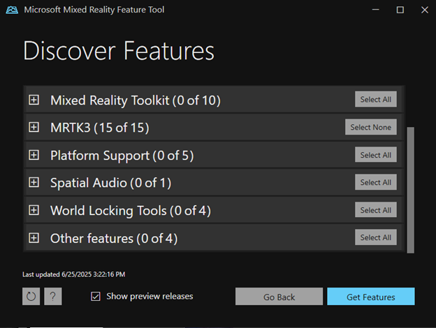
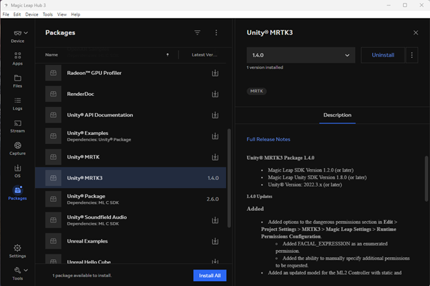
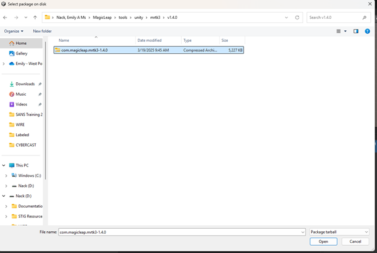
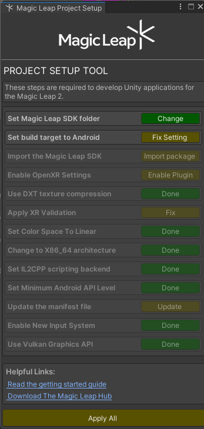
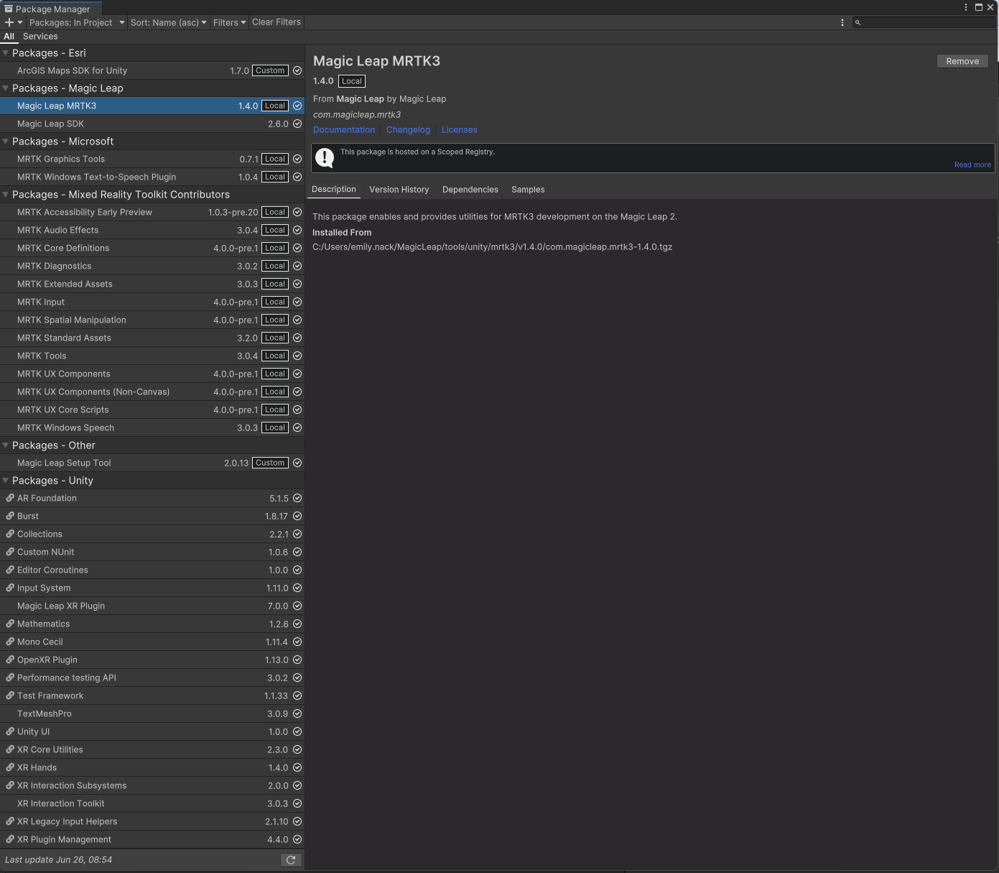

# CYBERCAST
Codebase for CYBERCAST: Cyber Battlefield Effects Correlation and Simulation Tool

## Prerequisites

Ensure you have the following installed on your machine before proceeding:

- [Unity Hub](https://unity.com/download)
- Unity Editor version `2022.3.48f1`
- Git (for cloning the repository)
- [Magic Leap Hub](https://developer-docs.magicleap.cloud/docs/guides/getting-started/install-the-tools/#install-magic-leap-hub)

---

## Project Setup Instructions

### 1. Clone and Open the Project
```bash
git clone https://github.com/CMSRL/CYBERCAST.git
```

- Open the project via Unity Hub using version `2022.3.48f1`
- When prompted about "Safe Mode," select **Ignore**

---

### 2. Unity Package Installation

Install the following packages via Unity's **Package Manager**:

- **XR Interaction Toolkit**
- **TextMeshPro**
- **Magic Leap XR Plugin**
- **ArcGIS Maps SDK for Unity**  
  [Asset Store Link](https://assetstore.unity.com/packages/tools/integration/arcgis-maps-sdk-for-unity-258537)

---

### 3. MRTK3 (Mixed Reality Toolkit 3) Configuration

#### A. Install Mixed Reality Feature Tool
Download and install the [Mixed Reality Feature Tool](https://learn.microsoft.com/en-us/windows/mixed-reality/develop/unity/welcome-to-mr-feature-tool) to manage MRTK3 dependencies

Install all MRTK3 Packages



#### B. Configure for Magic Leap

Ensure Unity MRTK3 is installed within Magic Leap Hub 3



Follow Magic Leap’s MRTK3 integration guide:  
[Magic Leap MRTK3 Setup](https://developer-docs.magicleap.cloud/docs/guides/third-party/mrtk3/mrtk3-setup/)

The tarball file should be located at: `~/MagicLeap/tools/unity/mrtk3/`



---

### 4. Magic Leap Setup Tool

Install the **Magic Leap Setup Tool**:

- [Unity Asset Store Link](https://assetstore.unity.com/packages/tools/integration/magic-leap-setup-tool-194780)  
- [Configuration Guide](https://developer-docs.magicleap.cloud/docs/guides/unity/getting-started/configure-unity-settings/)

> After installation, close and re-open the Unity project. Ignore the "Safe Mode" prompt again. Unity will detect Magic Leap and prompt for additional setup



Select 'Apply All' to fix broken settings

---

### 5. ArcGIS API Key

You must set your own ArcGIS API Key:
- Follow the guide [here](https://developers.arcgis.com/unity/install-and-set-up/) for initial setup

---

## Summary Checklist

- [ ] Unity Hub + Unity 2022.3.48f1 installed
- [ ] Project cloned and opened (Safe Mode ignored)
- [ ] XR Interaction Toolkit, TextMeshPro, and Magic Leap XR Plugin installed
- [ ] Magic Leap Hub + Setup Tool installed
- [ ] MRTK3 configured via Mixed Reality Feature Tool
- [ ] ArcGIS SDK imported and API key configured
- [ ] Android build target set + Magic Leap SDK + MRTK3 Magic Leap imported

You should see the following packages within the Unity Package Manager


---

## Troubleshooting

If errors occur (e.g., missing `MagicLeapInputs` or `AndroidExternalToolsSettings`), ensure:
- The correct platform build target is selected (Android)
- All Magic Leap and XR packages are installed via the Package Manager or the Setup Tool
- You are using Unity 2022.3.48f1

---

## Questions?

> Please contact Dr. Matthew Corbett - matthew.corbett@westpoint.edu
